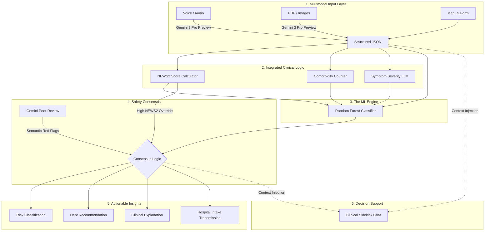

# CliniFlow Architecture Specification

This document provides a technical overview of the CliniFlow Multimodal Triage System, including Mermaid.js diagrams for visualization.

## 1. High-Level System Workflow
The system uses a multi-stage pipeline to convert raw multimodal input into a clinical triage decision.

## 2. Data Architecture & Schema
The patient data travels through the system as a `PatientData` object.

| Field | Type | Description |
| :--- | :--- | :--- |
| `patient_id` | String | Unique identifier |
| `age` | Integer | Patient age |
| `gender` | Enum | Male, Female, Other |
| `symptoms` | String | Raw or LLM-extracted complaints |
| `heart_rate` | Integer | bpm |
| `temp` | Float | Celsius |
| `systolic_bp` | Integer | mmHg |
| `diastolic_bp` | Integer | mmHg |
| `pre_existing` | String | Comorbidities (comma-separated) |

## 3. The Clinical "Brain" (Hybrid Model)
CliniFlow combines three distinct types of intelligence:

1.  **Deterministic (NEWS2):** Hard-coded medical rules that cannot be "fooled" by probabilistic models.
2.  **Statistical (ML):** A Random Forest model that identifies complex patterns across 5,000+ historical cases.
3.  **Semantic (LLM):** Gemini identifies subtle nuances in language (e.g., "crushing" vs "sharp" pain) that numbers miss.

## 4. The Clinical Sidekick (Context-Aware Chat)
The system includes a persistent AI assistant that provides real-time clinical decision support.

- **Context-Awareness:** The `/chat` endpoint receives the current `PatientData` and the calculated `TriageResult`. This allows the LLM to "see" the same data as the ML model.
- **Utility:**
    - **Black-Box Transparency:** Explains *why* the ML model predicted a certain risk level.
    - **Clinical Reasoning:** Connects symptoms (semantic) with vitals (physiological) to provide a holistic view.
    - **Differential Support:** Suggests potential conditions to investigate based on the "Scribe" extraction.
- **Implementation:** Uses a system-prompt injection technique where the current session state is formatted as JSON and provided to the LLM with every query.

## 5. Component Stack
- **Frontend:** React + Vite + Material UI (MUI)
- **Backend:** FastAPI (Python)
- **AI Models:** 
    - Gemini 3 Pro Preview (Extraction & Explanation)
    - Scikit-Learn Random Forest (Risk Prediction)
- **Database:** Firebase Firestore (History & Analytics)
- **Auth:** Firebase Authentication

## 5. Security & Interoperability (Roadmap)
- **Transmission:** HL7 FHIR Standard
- **Compliance:** HIPAA-ready design (Zero-knowledge local processing where possible)
- **Encryption:** AES-256 for data at rest, TLS 1.3 for data in transit.
